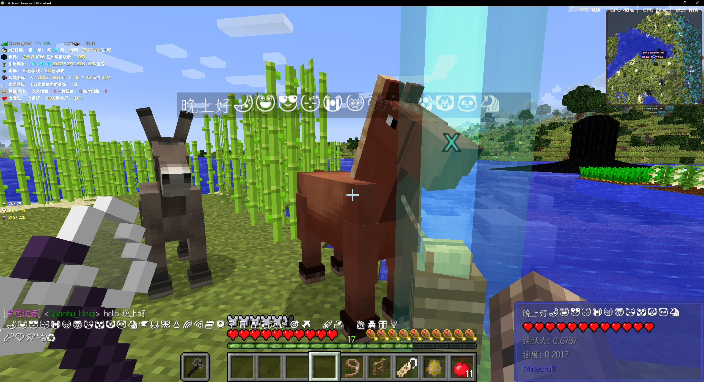

# Qz-FontRender

一个高性能、跨语种支持的字体渲染引擎，完整支持 Unicode 多语种平面，带来流畅且多样的字体显示体验。现在，在 Minecraft 中轻松使用 Emoji 和各种特殊字符！

## 功能特点

- ✅ 全 Unicode 支持，覆盖基本多文种平面及更多辅助平面
- ✅ 平滑字体渲染，提供优质显示效果
- ✅ 专为 Minecraft 优化，无缝集成 Emoji 和特殊符号
- ✅ 跨语言兼容，支持包括中文、英文、日文、韩文及众多其他语言字符
- ✅ 无Mixin实现的字体渲染器，理论最高优先级渲染

## 预览

## 使用说明

（此处可补充安装方式、代码示例或使用教程）

---

欢迎贡献代码、提出问题或建议！让我们一起打造更强大的 Minecraft 字体渲染体验。