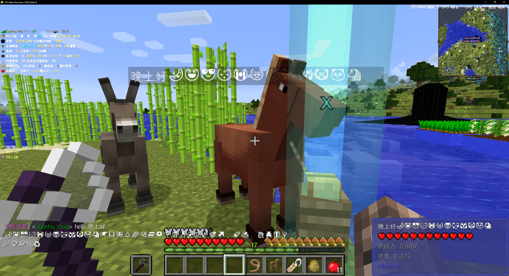

# Qz-FontRender

一个高性能、跨语种支持的字体渲染引擎，完整支持 Unicode 多语种平面，带来流畅且多样的字体显示体验。现在，在 Minecraft 中轻松使用 Emoji 和各种特殊字符！

## 功能特点

- ✅ 全 Unicode 支持，覆盖基本多文种平面及更多辅助平面
- ✅ 平滑字体渲染，提供优质显示效果
- ✅ 专为 Minecraft 优化，无缝集成 Emoji 和特殊符号
- ✅ 跨语言兼容，支持包括中文、英文、日文、韩文及众多其他语言字符
- ✅ 无Mixin实现的字体渲染器，理论最高优先级渲染

## 预览

* 初版 
* 稳定版本效果1 
* 稳定版本效果2 

## 使用说明

- **切换字体**：您可以通过调整 `fonts` 文件夹中字体文件的**排序顺序**来切换当前使用的字体。更换后，请在游戏中点击**资源包界面的“确定”按钮**，即可重新加载字体生效。

- **字体回滚机制**：当某个字体无法渲染特定字符时，渲染器将自动依照排序顺序尝试后续字体，确保字符显示无缝兼容。

- **彩色EMJ相关**: 如果需要使用彩色EMJ和字符，可以使用JetBrain的JDK来启动游戏，如果您发现有其他可以渲染彩色字符的JDK欢迎讨论

---

欢迎贡献代码、提出问题或建议！让我们一起打造更强大的 Minecraft 字体渲染体验。

---

# Qz-FontRender

A high-performance, cross-language font rendering engine with full support for Unicode multi-lingual planes, delivering smooth and diverse font display experiences. Now, easily use Emojis and various special characters in Minecraft!

## Features

- ✅ Full Unicode support, covering the Basic Multilingual Plane (BMP) and additional supplementary planes
- ✅ Smooth font rendering for high-quality display
- ✅ Optimized for Minecraft, seamlessly integrating Emojis and special symbols
- ✅ Cross-language compatibility, supporting characters from Chinese, English, Japanese, Korean, and many other languages
- ✅ Mixin-free font renderer implementation, achieving theoretically highest-priority rendering

## Usage Instructions

- **Switching Fonts**: You can change the currently used font by adjusting the **order of font files** in the `fonts` folder. After making changes, click the **"Confirm" button on the Resource Pack screen** in the game to reload the fonts and apply the changes.

- **Font Fallback Mechanism**: If a specific font cannot render a certain character, the renderer will automatically attempt to use the next font in the order, ensuring seamless character display compatibility.

---

Contributions, issues, and suggestions are welcome! Let's work together to build a more powerful Minecraft font rendering experience.
